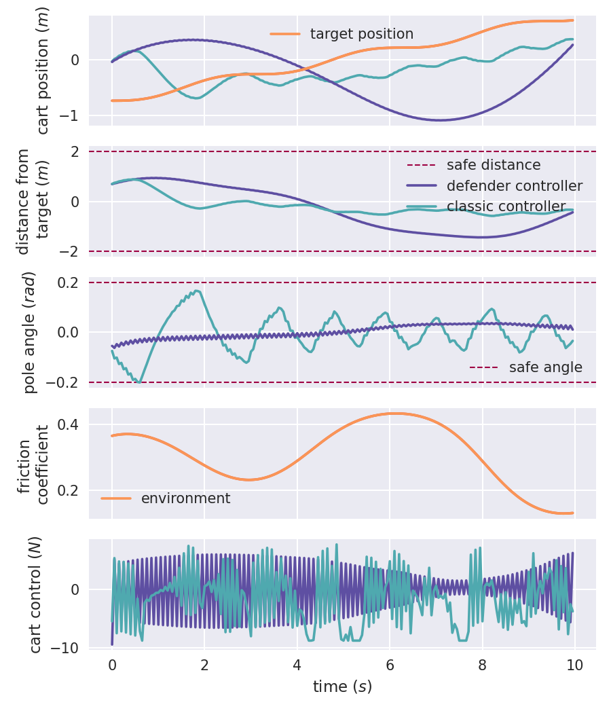
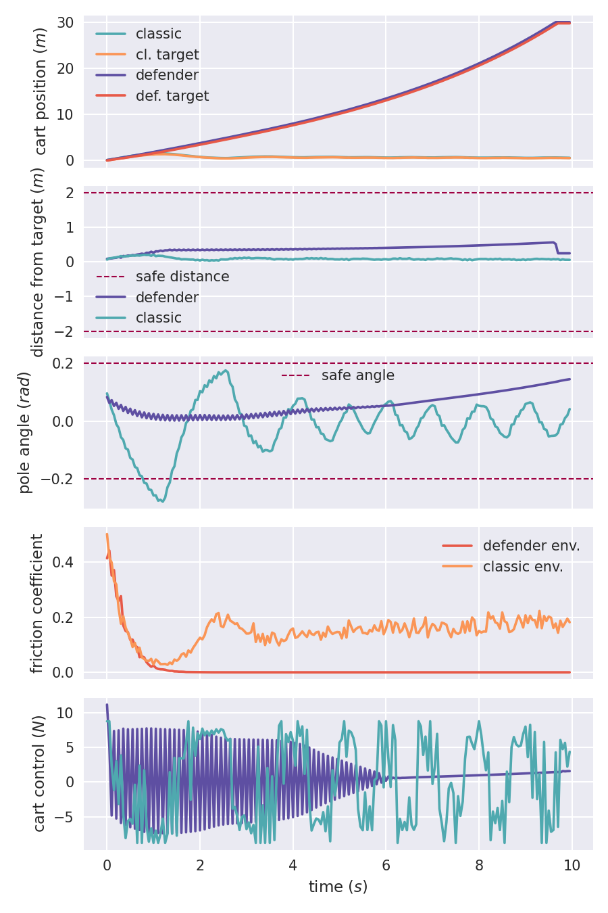
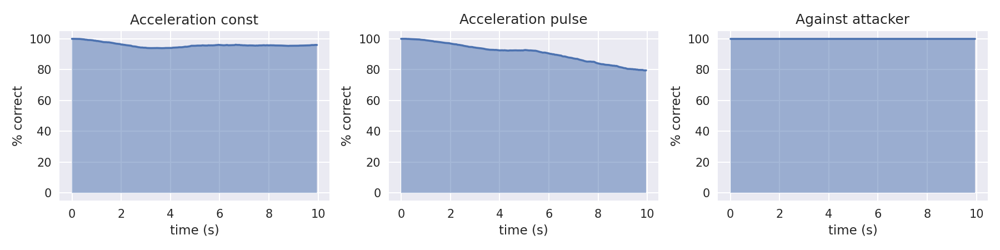
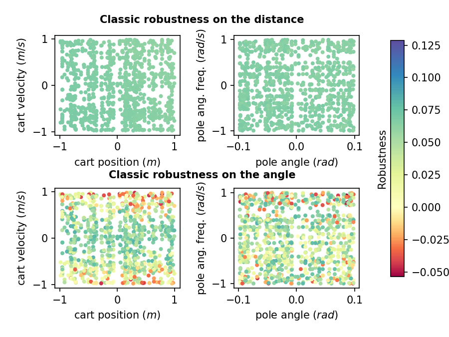
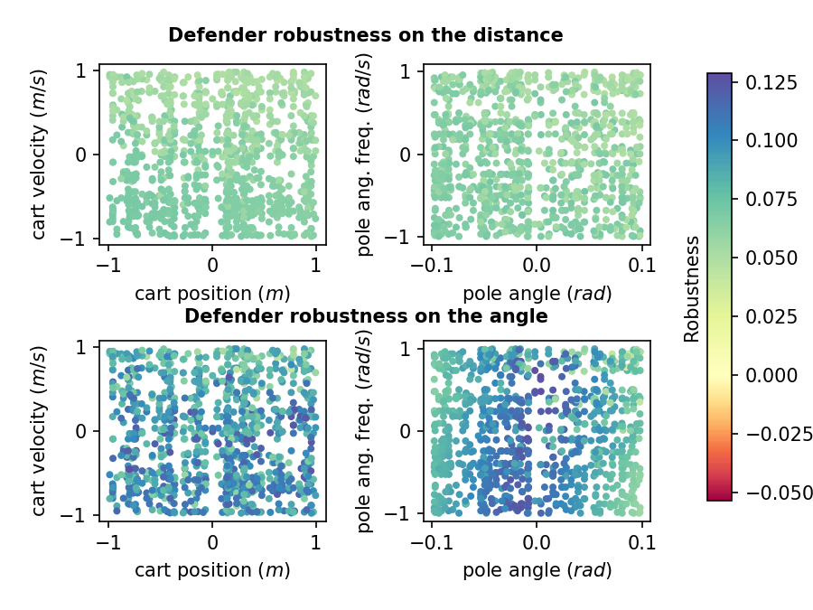

# Adversarial Learning of Robust and Safe Controllers for Cyber-Physical Systems 

Code for paper "Adversarial Learning of Robust and Safe Controllers for Cyber-Physical Systems", Luca Bortolussi, Francesca Cairoli, Ginevra Carbone, Francesco Franchina, Enrico Regolin, 2020.

## Abstract
We introduce a novel learning-based approach to synthesize safe and robust con- trollers for autonomous Cyber-Physical Systems and, at the same time, to generate challenging tests. This procedure combines formal methods for model verification with Generative Adversarial Networks. The method learns two Neural Networks: the first one aims at generating troubling scenarios for the controller, while the second one aims at enforcing the safety constraints. We test the proposed method on a variety of case studies.

## Experiments

### Code structure

- `architecture/` contains the general GAN architecture and training / testing procedures
- `utils/diffquantitative.py` provides the logic to write, parse and check STL requirements
- `utils/misc.py` groups some minor helper functions
- `model/` contains specific models for the different experimental setups, i.e. the attacker, the defender and the differential equations for the evolution of the system
- `settings/` contains the initial configuration for each case study
- `train_*`, `tester_*` and `plotter_*` scripts execute, store and plot the simulations

### Quick start

Once the repository has been cloned, create a python3 virtual environment and install the specified requirements.
```
pip3 install virtualenv
virtualenv -p python3 venv
source venv/bin/activate
pip install -r requirements.txt
cd src/
```

### Reproduce experiments

Change model settings in `src/settings/*`.

```
python train_*.py 
python tester_*.py -r=N_SIMULATIONS
python plotter_*.py -r=N_SIMULATIONS
```

Models and plots are saved in `experiments/`.

### Cartopole with target example 

```
python train_cartpole_target.py 
python tester_cartpole_target.py -r=1000
python plotter_cartpole_target.py -r=1000
```

  

 

 

  

## Licence
Creative Commons 4.0 CC-BY
[](https://creativecommons.org/licenses/by/4.0/)
